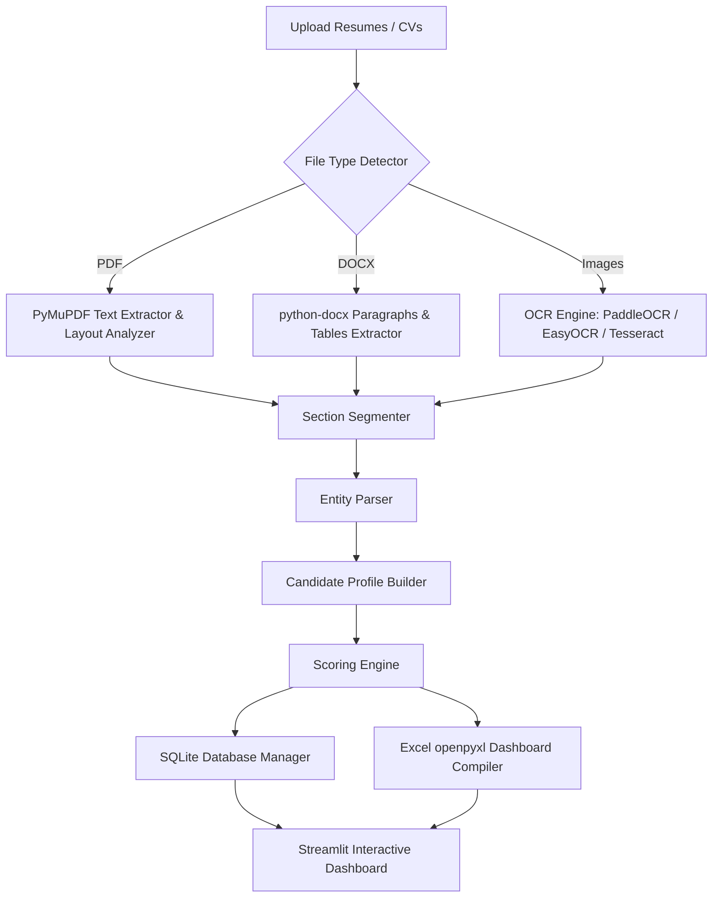

# Faculty Resume Parser & Evaluation System

A production-ready, fully offline Faculty Resume Parser and Automated Faculty Evaluation System built using Python, Streamlit, SQLite, and OpenPyXL. This application is specifically designed for academic recruitment, allowing universities to parse candidate CVs, detect qualifications and publications, calculate teaching durations, calculate scores, and generate styled Excel sheets.

## 🛠️ Architecture Diagram



---

## 📊 Database Schema

The database runs on SQLite (`faculty_evaluator.db`) and enforces foreign key constraints. The schema consists of three tables connected via 1-to-1 cascading relations:

### 1. `candidates` Table
Stores basic contact and calculated experience metrics.
* `id` (INTEGER, Primary Key, Auto Increment)
* `name` (TEXT, Not Null)
* `email` (TEXT)
* `phone` (TEXT)
* `highest_qualification` (TEXT)
* `teaching_experience_years` (REAL)
* `created_at` (TIMESTAMP)

### 2. `resume_data` Table
Stores raw text and parsed segment sections.
* `candidate_id` (INTEGER, Primary Key, Foreign Key referencing `candidates(id)`)
* `filename` (TEXT)
* `file_type` (TEXT)
* `raw_text` (TEXT)
* `sections_json` (TEXT)
* `extracted_info_json` (TEXT)

### 3. `scores` Table
Stores scoring breakdowns and explanation reports.
* `candidate_id` (INTEGER, Primary Key, Foreign Key referencing `candidates(id)`)
* `qualification_score` (REAL)
* `publication_score` (REAL)
* `research_guidance_score` (REAL)
* `teaching_score` (REAL)
* `patent_score` (REAL)
* `extracurricular_score` (REAL)
* `total_score` (REAL)
* `explanation_report` (TEXT)

---

## ⚙️ Configurable Scoring System

Scoring parameters are defined in `scoring_config.json` and can be edited in real-time in the Streamlit Sidebar.

| Metric | Scoring Rules / Bands | Max Cap |
| :--- | :--- | :--- |
| **Qualifications** | PhD = 10 pts \| PG = 10 pts \| Graduate = 5 pts | 10 pts |
| **Publications** | 0-2 = 2 pts \| 3-5 = 5 pts \| 6-10 = 8 pts \| 10+ = 10 pts | 10 pts |
| **Teaching Exp** | 0-2 yrs = 1 pt \| 2-5 yrs = 3 pts \| 5+ yrs = 5 pts | 5 pts |
| **Research Guidance**| PhD (2 pts/each) \| PG (1 pt/each) \| Project (1 pt/each) | 10 pts |
| **Patents** | Granted (5 pts/each) \| Filed (2 pts/each) | 10 pts |
| **Extra Curricular** | Event, NSS, NCC, Sports, coordinator etc. (1 pt/each) | 5 pts |

---

## ⚡ Installation & Execution Guide

### Prerequisite
Make sure Python 3.10+ is installed on your system.

### Step 1: Clone or Open Workspace
Navigate to the project root directory:
```bash
cd /Users/parthbole/.gemini/antigravity-ide/scratch/faculty_resume_evaluator
```

### Step 2: Initialize Virtual Environment
Create and activate the Python virtual environment:
```bash
# macOS / Linux
python3 -m venv .venv
source .venv/bin/activate

# Windows
python -m venv .venv
.venv\Scripts\activate
```

### Step 3: Install Dependencies
Install packages listed in `requirements.txt`:
```bash
pip install -r requirements.txt
```

### Step 4: Run System Verification
Run the verification test suite to ensure the SQLite layer, heuristics, scoring engine, and Excel generator are functional:
```bash
python verify_system.py
```

### Step 5: Start Streamlit Application
Launch the Streamlit dashboard:
```bash
streamlit run app.py
```
This will open the application in your default web browser (usually at `http://localhost:8501`).
